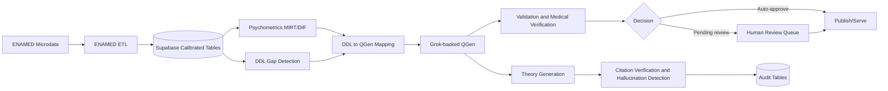

# Architecture Map

This map is grounded only in observed repository implementation.

## Psychometrics: MIRT 5D
- Implementation: `packages/shared/src/calculators/mirt.ts:2-2`, `packages/shared/src/calculators/mirt.ts:244-244`, `packages/shared/src/calculators/unified-learner-model.ts:12-12`
- Key functions/classes: mirtProbability, estimateMIRT_MAP, unified signal weighting
- Inputs: item parameters + response correctness
- Outputs: theta profile per dimension + composite ability
- Data flow role: feeds adaptive learner model and item targeting

## Fairness layer: DIF
- Implementation: `packages/shared/src/calculators/dif.ts:2-2`, `packages/shared/src/calculators/dif.ts:231-231`, `packages/shared/src/calculators/dif.ts:252-252`
- Key functions/classes: classifyDIF, analyzeDIF
- Inputs: item response groups (focal/reference)
- Outputs: ETS A/B/C DIF classification
- Data flow role: flags bias signals for psychometric governance

## Scheduling: SM-2 and FSRS
- Implementation: `packages/shared/src/calculators/sm2.ts:2-2`, `packages/shared/src/calculators/sm2.ts:60-60`, `packages/shared/src/calculators/fsrs.ts:2-2`, `packages/shared/src/calculators/fsrs.ts:476-476`
- Key functions/classes: calculateNextInterval, reviewCard, migrateSM2toFSRS
- Inputs: review outcomes, intervals, ease/difficulty state
- Outputs: next review intervals, due-card state
- Data flow role: drives spaced repetition timing

## Content generation (QGen + Grok)
- Implementation: `apps/web/lib/qgen/services/qgen-generation-service.ts:81-81`, `apps/web/lib/qgen/services/qgen-generation-service.ts:94-94`, `apps/web/lib/qgen/services/qgen-generation-service.ts:116-116`
- Key functions/classes: generateQuestion, generateBatch, estimateTokens, calculateCost
- Inputs: generation config (area/topic/difficulty/Bloom)
- Outputs: generated question + validation result + token/cost proxy
- Data flow role: produces candidate items for validation and review

## Verification and auto-approval
- Implementation: `apps/web/lib/qgen/services/qgen-validation-service.ts:5-5`, `apps/web/lib/qgen/services/qgen-validation-service.ts:35-35`, `apps/web/lib/qgen/services/medical-verification-service.ts:107-107`
- Key functions/classes: validateQuestion, determineDecision, checkDangerousPatterns
- Inputs: generated question content
- Outputs: scores, flags, decisions (auto-approve/pending/reject)
- Data flow role: gate between generation and publishing/review

## Expert review workflow
- Implementation: `apps/web/app/api/qgen/review/route.ts:5-5`, `apps/web/app/api/qgen/review/route.ts:134-134`, `infrastructure/supabase/migrations/qgen/001_qgen_core_tables.sql:586-586`
- Key functions/classes: review queue endpoint, human review persistence
- Inputs: pending_review questions + reviewer decisions
- Outputs: approved/rejected/needs_revision status updates
- Data flow role: human override and quality control

## Hallucination control / citation verification
- Implementation: `apps/web/lib/theory-gen/services/citation-verification-service.ts:11-11`, `apps/web/lib/theory-gen/services/citation-verification-service.ts:182-182`, `apps/web/app/api/theory-gen/audit/route.ts:4-4`, `infrastructure/supabase/migrations/007_theory_generation_system.sql:165-165`
- Key functions/classes: verifyCitation, verifyAllCitations, detectHallucinations
- Inputs: claims + citation URLs + metadata
- Outputs: verification scores, unsupported-claim flags, audit trails
- Data flow role: safety/grounding layer for theory generation

## DDL learning-gap detection + adaptive mapping
- Implementation: `apps/web/lib/ddl/services/ddl-service.ts:37-37`, `apps/web/lib/ddl/services/batch-service.ts:56-56`, `apps/web/lib/qgen/services/ddl-integration-service.ts:139-139`, `infrastructure/supabase/supabase/migrations/20260201190001_ddl_core_tables.sql:2-2`
- Key functions/classes: analyzeResponse, batch processing, generateAdaptiveQuestion
- Inputs: student free text responses + behavioral/semantic signals
- Outputs: lacuna classification + targeted QGen configs + feedback
- Data flow role: closes loop from diagnosis of gap to adaptive generation

## ENAMED calibration ETL
- Implementation: `infrastructure/supabase/seed/enamed-2025-etl/README.md:1-1`, `infrastructure/supabase/seed/enamed-2025-etl/parsers/item-parameters.ts:3-3`, `infrastructure/supabase/seed/enamed-2025-etl/parsers/participant-data.ts:178-178`, `infrastructure/supabase/seed/enamed-2025-etl/types.ts:10-10`
- Key functions/classes: item/participant parsers, area mapping, SQL generation
- Inputs: official ENAMED microdata files
- Outputs: calibrated item/user data for platform ingestion
- Data flow role: links official calibration data to adaptive engine

## Mermaid Diagram

Evidence anchors:
- ENAMED ETL: `infrastructure/supabase/seed/enamed-2025-etl/README.md:1-1`
- Psychometrics: `packages/shared/src/calculators/mirt.ts:2-2`
- DDL: `apps/web/lib/ddl/services/ddl-service.ts:37-37`
- QGen generation: `apps/web/lib/qgen/services/qgen-generation-service.ts:94-94`
- Validation: `apps/web/lib/qgen/services/qgen-validation-service.ts:35-35`
- Human review: `apps/web/app/api/qgen/review/route.ts:134-134`
- Hallucination audit: `infrastructure/supabase/migrations/007_theory_generation_system.sql:165-165`
